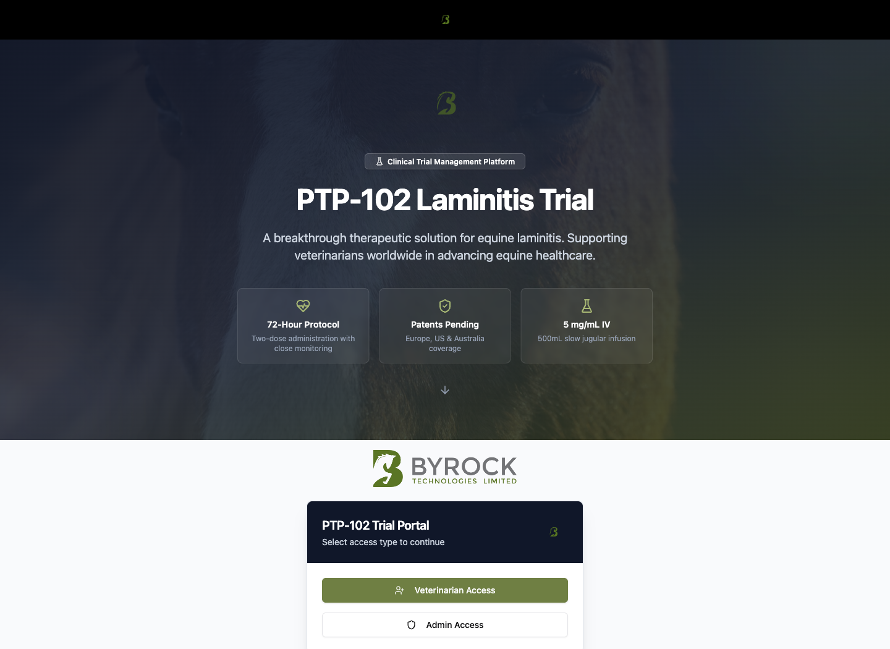
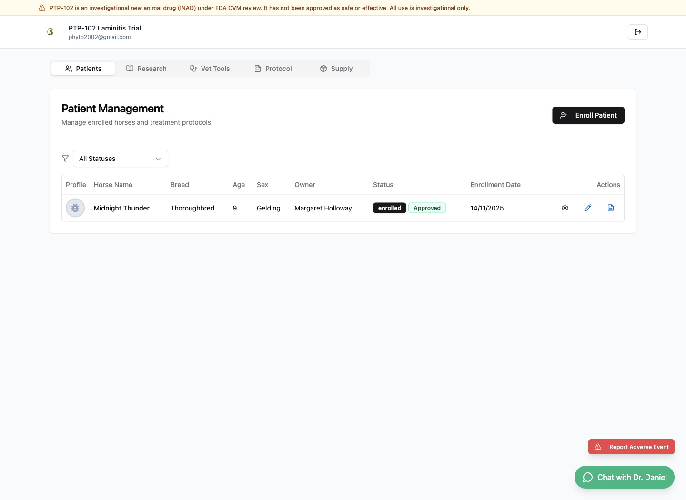
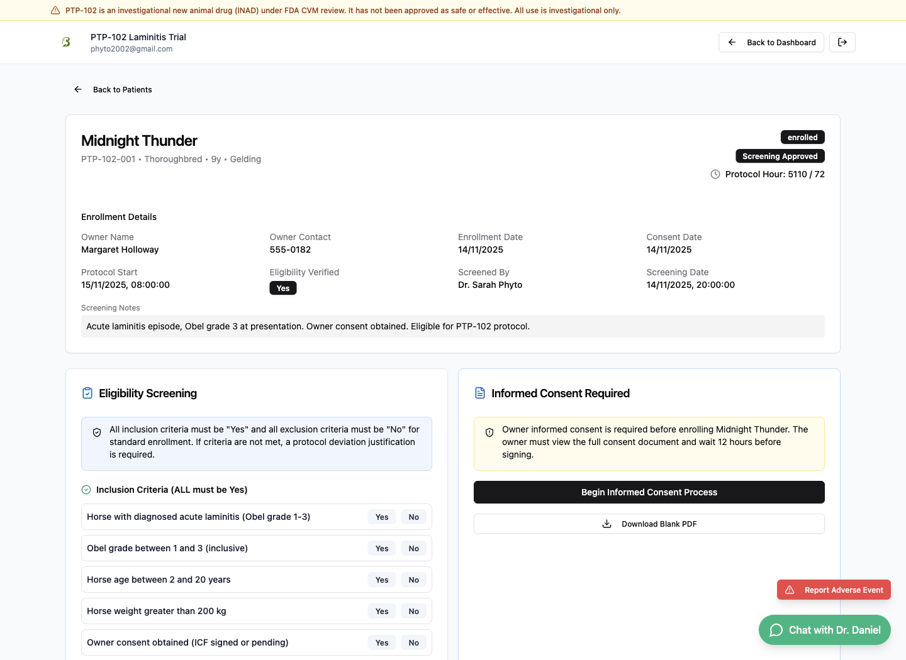
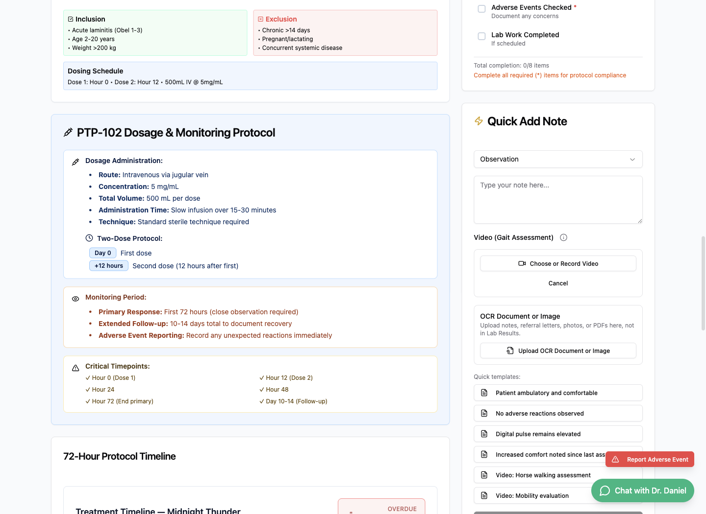
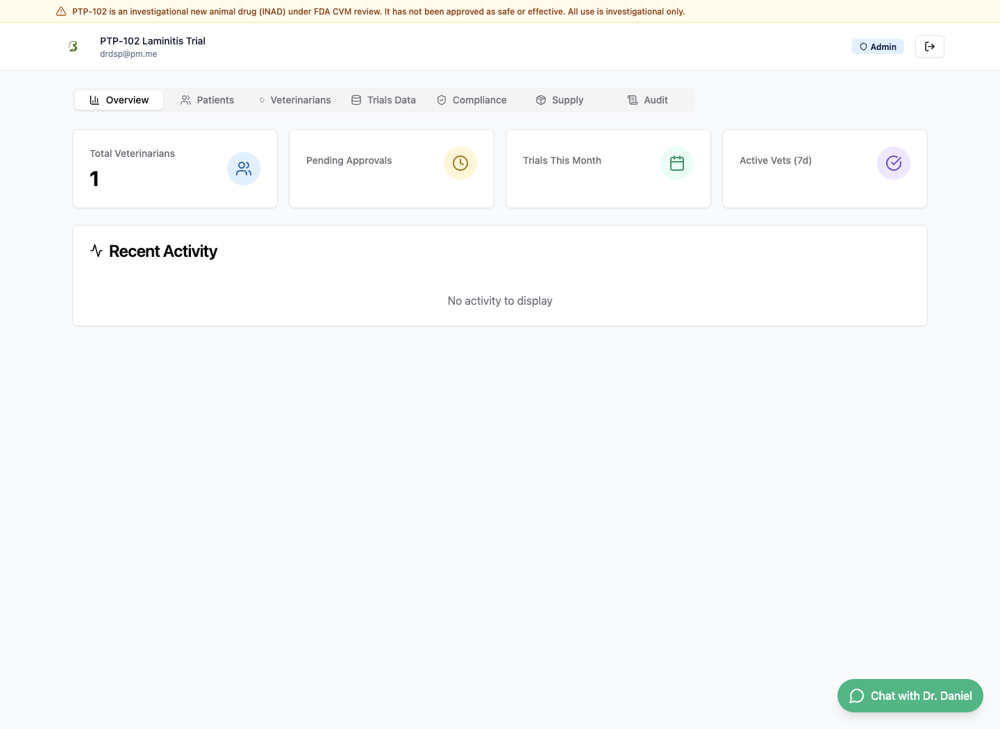

# PTP-102 Trial Portal: Veterinarian Guide with Internal Screenshots

Generated on 16 June 2026 from the local DRSP2/PTP-102 web app. This revision uses internal application screens captured with the documented admin account and the built-in demo veterinarian account. Passwords are intentionally not included in this guide.

This booklet is written for veterinarians and trial operators. It explains what the app does, how its security model affects day-to-day work, and how a vet uses the portal from login through patient review, case work, audit review, and final export.

## Screenshot Set

The screenshots are stored in `screenshots/` and linked with relative paths so the Markdown renders correctly in the repository.

| No. | Screenshot | App area |
| --- | --- | --- |
| 1 | `01-access-selection.png` | Public role selection |
| 2 | `02-vet-login.png` | Authenticated vet patient dashboard |
| 3 | `03-vet-registration.png` | Vet dashboard after access handoff |
| 4 | `04-vet-dashboard-patients.png` | Patient management tab |
| 5 | `05-vet-research-hub.png` | Research navigation state |
| 6 | `06-vet-tools.png` | Vet tools navigation state |
| 7 | `07-vet-protocol-documents.png` | Protocol navigation state |
| 8 | `08-vet-drug-supply.png` | Supply navigation state |
| 9 | `09-patient-details.png` | Patient detail / eligibility review |
| 10 | `10-patient-case-workspace.png` | Patient case workspace |
| 11 | `11-case-workflow-detail.png` | Case workflow detail state |
| 12 | `12-admin-login.png` | Admin overview after access handoff |
| 13 | `13-admin-overview.png` | Admin overview |
| 14 | `14-admin-patient-management.png` | Admin patient management navigation |
| 15 | `15-admin-veterinarian-management.png` | Admin veterinarian management navigation |
| 16 | `16-admin-trials-data.png` | Admin trials data navigation |
| 17 | `17-admin-compliance.png` | Admin compliance navigation |
| 18 | `18-admin-supply.png` | Admin supply navigation |
| 19 | `19-admin-audit-log.png` | Admin audit navigation |

---

## 1. What the App Does

PTP-102 Trial Portal is a clinical trial management app for an investigational equine laminitis treatment. It gives participating vets a single place to manage trial access, patient enrolment, eligibility screening, case details, treatment protocol activity, supporting documents, adverse events, study documents, supply information, audit records, and regulatory export preparation.

The app has two operational roles:

- **Veterinarian users** manage assigned horses and clinical workflow.
- **Admin users** oversee approvals, patient management, trial data, compliance, drug supply, and audit history.

The landing page also sets the clinical frame: a 72-hour protocol, 5 mg/mL IV treatment messaging, and investigational-use warnings.

---

## 2. Security and Secure Operation

### 2.1 Role-Based Access

The portal separates veterinarian and admin work. Vets should only use the veterinarian workflow unless they have explicit admin duties. Admin screens expose oversight functions and should not be used for routine case entry.

### 2.2 Login, Approval, and Qualification

The current app expects email/password authentication and then checks the vet's approval and investigator qualification state. In the local repo, password login depends on configured Supabase credentials; the internal screenshots were captured using the documented local/demo access path because the live Supabase login was not configured in this environment.

Operationally, this means:

- Identity is handled first through account login.
- Permission is handled second through vet approval and qualification status.
- Patient data should not be available to an unapproved or unqualified vet.
- Admin oversight is required for approvals, qualification review, and compliance review.

### 2.3 Secure Uploads and Downloads

The app includes secure upload/download handling for clinical files. Vets should upload only patient-relevant files, confirm the correct horse is open before upload, and avoid distributing copied storage URLs. Downloads should be treated as controlled clinical-trial records.

### 2.4 Audit Trail and Compliance

The app includes audit and compliance navigation for admin review. Audit history is important because trial records must show who changed what, when, and why.

For vets, the practical rule is simple: write entries as if another investigator, sponsor reviewer, or regulator will read them later.

### 2.5 Export Readiness

The app supports regulatory-style record export. Before exporting, the vet or admin should check patient identity, screening status, treatment entries, uploaded evidence, adverse events, and audit history.

---

## 3. Day-to-Day Veterinarian Tutorial

### Step 1: Choose Veterinarian Access

Open the portal and choose the veterinarian route from the landing page.

Use admin access only for oversight tasks.

### Step 2: Confirm You Are in the Vet Workspace

After login and approval checks, the vet workspace shows the investigator email, the adverse-event shortcut, and the main tabs: Patients, Research, Vet Tools, Protocol, and Supply.

If the app shows an investigator qualification wizard instead of patient data, complete the required credentials, GCP training, facility, agreement, and protocol steps before proceeding.

### Step 3: Review the Patient List

The Patients tab is the vet's starting point for day-to-day work. It lists horses, breed, age, sex, owner, status, enrolment date, and action controls.

Use this view to:

- Confirm the correct horse.
- Filter by status when available.
- Open a case or detail view.
- Start enrolment if authorised.
- Prepare a patient for export when complete.

### Step 4: Use the Support Tabs

The vet workspace includes support tabs alongside patient management.

Use Research for trial background and supporting scientific or study information.

Use Vet Tools for clinical utilities and workflow aids.

Use Protocol for study instructions and controlled protocol references.

Use Supply to review drug/NCIE shipment and supply information relevant to your work.

### Step 5: Open the Patient Detail View

Select the patient action to review the case before adding or relying on clinical information.

Check:

- Horse name and protocol ID.
- Breed, age, sex, owner, and owner contact.
- Enrolment date and consent date.
- Protocol start time.
- Screening notes.
- Inclusion and exclusion criteria.

### Step 6: Work in the Patient Case Workspace

Open the patient case workspace for the full case view.

The case workspace is where trial records should be maintained. Use it to review enrolment details, eligibility screening, treatment timing, assessments, and any related workflow controls exposed by the app.

### Step 7: Maintain the Clinical Record

The case workflow view shows the same patient context and keeps the vet inside the patient-specific record.

When entering clinical information:

- Record observations promptly.
- Use consistent clinical language.
- Attach files only to the correct patient.
- Document adverse events or deviations clearly.
- Avoid informal shorthand that would not make sense in an audit or export.

### Step 8: Review Audit and Compliance Before Export

Before exporting a patient record, check that the patient status, screening details, assessments, treatments, uploads, and adverse events are internally consistent. If admin review is needed, use the admin compliance and audit areas.

---

## 4. Admin Oversight Screens

The administrator workspace is not the vet's day-to-day workspace, but it explains how the trial is controlled.

Admin areas include:

- Overview metrics and recent activity.
- Patient management across vets.
- Veterinarian approval and management.
- Trial data review.
- Compliance dashboards.
- Drug supply oversight.
- Audit log review.

For secure operation, admin access should be limited to authorised personnel and should be used to review approvals, monitor compliance, and investigate audit history.

---

## 5. Local Capture Notes

- The app was run locally with `npm run dev:server` and `npm run dev`.
- The documented admin account and the built-in demo veterinarian account were identified and used only for local screenshot capture.
- Plaintext passwords are deliberately omitted from this guide.
- The live password login path reported configuration limitations in this local environment, so internal screenshots used the local/demo auth path rather than a production Supabase session.
- The repo is mid-migration: auth, registration, and secure upload/download are intended to use Supabase, while many clinical demo records are still localStorage-backed in the current codebase.

---

## 6. Practical Vet Checklist

### Start of Session

- Log in with your assigned veterinarian account.
- Confirm you are in the veterinarian workspace.
- Confirm your qualification/approval state is complete.
- Open the correct patient before entering clinical information.

### During Patient Work

- Review patient identity and screening criteria.
- Record assessments and treatment information promptly.
- Upload supporting files only to the correct case.
- Document adverse events and deviations clearly.
- Use protocol documents when uncertain.

### End of Session

- Review the patient status and outstanding tasks.
- Check whether any audit or admin review is needed.
- Export only when the record is complete.
- Log out before leaving the workstation.
